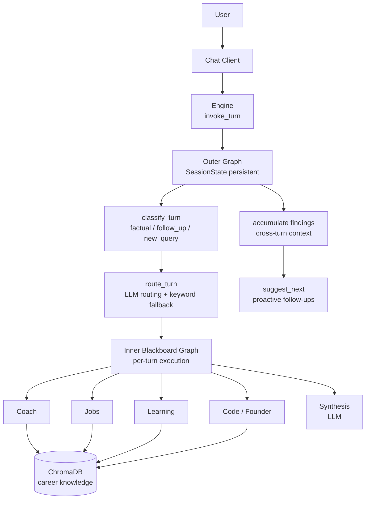

# FutureProof

[](https://www.python.org/downloads/)
[](LICENSE)
[](tests/)

Career intelligence agent that gathers professional data, searches job boards, analyzes career trajectories, and generates ATS-optimized CVs through conversational chat.

## Quick Start

```bash
# Install
pipx install fu7ur3pr00f

# Run
fu7ur3pr00f
```

In the chat:
- `/setup` — Configure your LLM provider
- `/gather` — Import LinkedIn, GitHub, portfolio, CliftonStrengths
- `/analyze` — Get skill gap analysis
- `/search` — Query 7 job boards + Hacker News
- `/generate` — Create ATS-optimized CV (Markdown + PDF)

## Installation

### Debian/Ubuntu (amd64)

```bash
curl -fsSL https://juanmanueldaza.github.io/fu7ur3pr00f/fu7ur3pr00f-archive-keyring.gpg | \
  sudo tee /usr/share/keyrings/fu7ur3pr00f-archive-keyring.gpg >/dev/null

echo "deb [arch=amd64 signed-by=/usr/share/keyrings/fu7ur3pr00f-archive-keyring.gpg] \
https://juanmanueldaza.github.io/fu7ur3pr00f stable main" | \
  sudo tee /etc/apt/sources.list.d/fu7ur3pr00f.list

sudo apt update && sudo apt install fu7ur3pr00f
```

### Development

```bash
git clone https://github.com/juanmanueldaza/fu7ur3pr00f.git
cd fu7ur3pr00f
pip install -e .
```

## Configuration

Run `/setup` in the chat, or manually edit `~/.fu7ur3pr00f/.env`:

```bash
# Pick ONE provider (auto-detected if empty)
FUTUREPROOF_PROXY_KEY=fp-...   # Default, zero config
OPENAI_API_KEY=sk-...
ANTHROPIC_API_KEY=sk-ant-...
GOOGLE_API_KEY=...
OLLAMA_BASE_URL=http://localhost:11434  # Local, offline
```

See [.env.example](.env.example) for all options.

## Chat Commands

| Command | Description |
|---------|-------------|
| `/help` or `/h` | Show help message |
| `/setup` | Configure LLM providers and API keys |
| `/gather` | Gather career data (LinkedIn, CliftonStrengths, CV, portfolio) |
| `/profile` | View your career profile |
| `/goals` | View your career goals |
| `/thread [name]` | Show or switch conversation thread |
| `/threads` | List saved user conversation threads |
| `/memory` | Show memory and profile stats |
| `/debug` | Toggle debug mode (verbose logging) |
| `/verbose` | Show system information |
| `/agents` | List available specialist agents |
| `/clear` | Clear current thread history |
| `/reset` | Factory reset (delete all generated data) |
| `/quit`, `/q`, or `/exit` | Exit chat |

## Architecture

### Multi-Agent with Blackboard Pattern



**Routing Architecture:**

- **LLM-based semantic routing**: Understands query intent, selects 1-4 specialists
- **Keyword fallback**: Deterministic fallback if LLM unavailable (rate limits, network errors)
- **Fast paths**: Factual queries → coach only; follow-ups → reuse previous specialists
- **Structured output**: `RoutingDecision` model guarantees valid specialist names
- **Specialist guidance**: All instructions load from `prompts/md/specialist_guidance.md` (no hardcoded fallbacks)
- **Direct model selection**: Purpose-specific models are selected from configured provider settings; invocation errors surface directly instead of retrying across models

**Design decisions:**

| Decision | Why |
|----------|-----|
| Multi-agent blackboard | Single agent with 41 tools; specialists provide focused reasoning via blackboard pattern |
| LLM routing | Keyword matching too brittle — "leverage strengths to win money" should route to 3 specialists, not 1 |
| Keyword fallback | Network-resilient: keeps routing obvious queries to the right specialist even if the LLM is unavailable |
| Direct model selection | Keeps model behavior explicit: choose the configured model and surface real errors instead of hiding them behind runtime fallback |
| Blackboard pattern | Multi-specialist analysis with shared context and iteration |
| Database-first | Gatherers index directly to ChromaDB — no intermediate files |
| Two-pass synthesis | `AnalysisSynthesisMiddleware` replaces generic LLM output with focused reasoning |
| HITL confirmation | Destructive/expensive operations require user approval via `interrupt()` |
| Prompt-driven | All specialist behavior from prompts folder, zero hardcoded fallbacks |

## Tools

**41 tools** organized by domain:

| Category | Tools |
|----------|-------|
| **Profile** (7) | `get_user_profile`, `update_user_name`, `update_current_role`, `update_salary_info`, `update_user_skills`, `set_target_roles`, `update_user_goal` |
| **Gathering** (5) | `gather_portfolio_data`, `gather_linkedin_data`, `gather_assessment_data`, `gather_cv_data`, `gather_all_career_data` |
| **GitHub** (3) | `search_github_repos`, `get_github_repo`, `get_github_profile` |
| **GitLab** (3) | `search_gitlab_projects`, `get_gitlab_project`, `get_gitlab_file` |
| **Knowledge** (4) | `search_career_knowledge`, `get_knowledge_stats`, `index_career_knowledge`, `clear_career_knowledge` |
| **Analysis** (3) | `analyze_skill_gaps`, `analyze_career_alignment`, `get_career_advice` |
| **Market** (6) | `search_jobs`, `get_tech_trends`, `get_salary_insights`, `analyze_market_fit`, `analyze_market_skills`, `gather_market_data` |
| **Financial** (2) | `convert_currency`, `compare_salary_ppp` |
| **Generation** (2) | `generate_cv`, `generate_cv_draft` |
| **Memory** (4) | `remember_decision`, `remember_job_application`, `recall_memories`, `get_memory_stats` |
| **Settings** (2) | `get_current_config`, `update_setting` |

## MCP Clients

**12 MCP clients** for real-time data access:

| Client | Purpose |
|--------|---------|
| `github` | Repository search, file access, profile |
| `financial` | Currency conversion, PPP comparison |
| `tavily` | Web search, salary research |
| `hn` | Hacker News jobs, trending discussions |
| `jobspy` | Multi-board job aggregation |
| `remoteok` | Remote job listings |
| `himalayas` | Remote job listings |
| `remotive` | Remote job listings |
| `jobicy` | Remote job listings |
| `weworkremotely` | Remote job listings |
| `devto` | Developer articles, trends |
| `stackoverflow` | Tag trends, popular questions |

## Development

```bash
# Install dev tools
pip install pyright pytest ruff

# Test
pytest tests/ -q
pyright src/fu7ur3pr00f
ruff check .
ruff check . --fix
```

### Scripts

| Script | Purpose |
|--------|---------|
| `scripts/setup.sh` | One-time Azure/config setup |
| `scripts/fresh_install_check.sh` | Validate pipx install |
| `scripts/clean_dev_artifacts.sh` | Clean build artifacts |
| `scripts/build_deb.sh` | Build .deb package |
| `scripts/build_apt_repo.sh` | Build apt repository |
| `scripts/validate_apt_artifact.sh` | Test .deb in Docker |
| `scripts/vagrant.sh` | Vagrant VM management |

### Testing

```bash
# Unit tests
pytest tests/ -q

# Benchmarks
pytest tests/benchmarks/ -v

# Fresh install check
scripts/fresh_install_check.sh --source local --config-from .env

# Vagrant apt repo testing
scripts/vagrant.sh test-apt

# Multi-agent system testing
scripts/vagrant.sh multi
```

Offline behavior:
- Specialist routing falls back to deterministic keyword scoring in CI or other offline environments.
- CV parsing falls back to local heading extraction for Markdown and plain-text resumes when LLM section extraction is unavailable.
- Sensitive LinkedIn/social sections such as conversations and sponsored message threads are excluded before knowledge indexing, not just hidden at search time.

## System Dependencies (Optional)

| Feature | Package |
|---------|---------|
| GitLab CLI | `sudo apt install glab` |
| CliftonStrengths PDF parsing | `sudo apt install poppler-utils` |
| CV PDF export | `sudo apt install libpango-1.0-0 libpangoft2-1.0-0 libcairo2 libfontconfig1 libgdk-pixbuf-2.0-0` |

## Tech Stack

Python 3.13 · LangChain + LangGraph · ChromaDB · Typer + Rich · WeasyPrint · MCP

## Documentation

Documentation is embedded in the codebase:

- **Prompts**: [`src/fu7ur3pr00f/prompts/md/`](src/fu7ur3pr00f/prompts/md/) — All system and specialist prompts
- **Tools**: [`src/fu7ur3pr00f/agents/tools/`](src/fu7ur3pr00f/agents/tools/) — Tool implementations with docstrings
- **MCP Clients**: [`src/fu7ur3pr00f/mcp/`](src/fu7ur3pr00f/mcp/) — MCP client implementations
- **Memory**: [`src/fu7ur3pr00f/memory/`](src/fu7ur3pr00f/memory/) — ChromaDB, RAG, episodic memory
- **Gatherers**: [`src/fu7ur3pr00f/gatherers/`](src/fu7ur3pr00f/gatherers/) — Data collection modules
- **Specialists**: [`src/fu7ur3pr00f/agents/specialists/`](src/fu7ur3pr00f/agents/specialists/) — Multi-agent specialists and orchestrator
- **Blackboard**: [`src/fu7ur3pr00f/agents/blackboard/`](src/fu7ur3pr00f/agents/blackboard/) — Blackboard pattern implementation

Key documentation files:
- [`QWEN.md`](QWEN.md) — Project context for AI assistants
- [`GEMINI.md`](GEMINI.md) — Additional project documentation
- [`.env.example`](.env.example) — Configuration reference

---

Licensed under [GPL-2.0](LICENSE).
